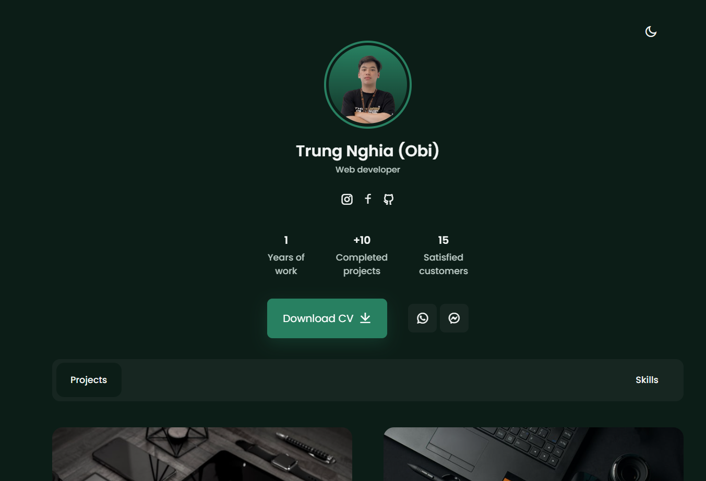

# 💻 Mini portfolio by Obi.
## Inspired by Bedimcode.
### _This website include_:
* Two different tab: Project and Skills.
* Downloadable CV file (not available at the momment😞).
* Two button : phone number (fake😅) and message button lead to my Facebook Messenger (ladies 😉)
* Links leaded to my social accounts (Facebook, Instagram and Github).
* And some of my projects that I think is suitable to put in.

### Technologie used in this website:

    

### Preview image:

